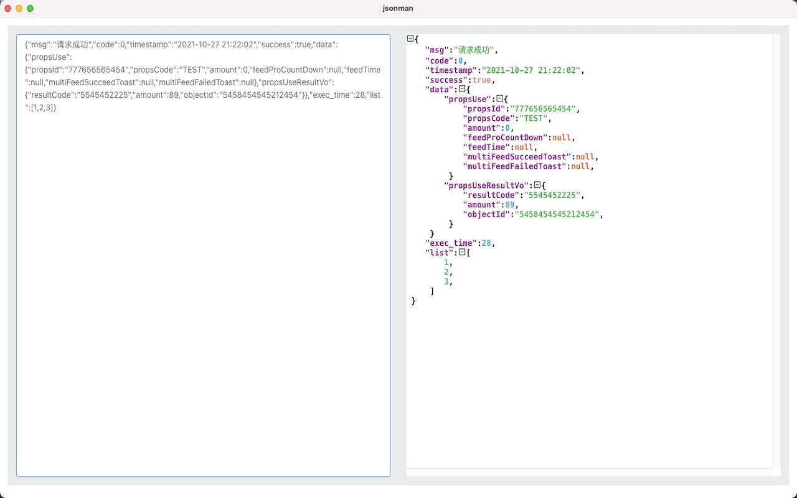

# jsonman
json formater，安全的json格式化工具

## 已开发功能
+ json格式化
+ url编码和解码
+ url编码和解码新增智能切割
+ 运算符的结核性和优先性


## 待开发功能
+ xml格式解析
+ int最大值（数据类型最大值）
+ ascii 码转换


## 待修复bug
+ json print显示不下，未自动换行

```
{"forms":[{"formColDeclareList":[{"appId":10001,"colBussForm":"{\"displaySign\":0,\"editableSign\":1}","colBussList":"{\"listSign\":1,\"searchSign\":1,\"containSign\":1,\"index\":999}","colDeclareSign":1,"colInspect":"{}","colLayout":"{\"labelCol\":8,\"wrapperCol\":16,\"colSize\":12,\"colRow\":10,\"colIndex\":5}","colName":"str1","colProps":"{\"mode\":\"default\",\"maxLength\":2,\"minLength\":32}","colTitle":"标题","colType":"FormText","containSign":1,"defaultVal":"","disableSign":0,"fid":1466651528822554624,"formName":"Test1","searchSign":1,"sid":1466652684852428800},{"appId":10001,"colBussForm":"{\"displaySign\":0,\"editableSign\":1}","colBussList":"{\"listSign\":1,\"searchSign\":0,\"containSign\":0,\"index\":999}","colDeclareSign":1,"colInspect":"{}","colLayout":"{\"labelCol\":8,\"wrapperCol\":16,\"colSize\":12}","colName":"desc","colProps":"{\"mode\":\"default\"}","colTitle":"描述","colType":"FormTextarea","containSign":0,"defaultVal":"","disableSign":0,"fid":1466651528822554624,"formName":"Test1","searchSign":0,"sid":1466653066949328896}],"formColStoreList":{},"formDeclare":{"appId":10001,"disableSign":1,"formGroup":"emg","formName":"Test1","formTitle":"Test动态表单","mainColName":"","sid":1466651528822554624,"thirdBusiness":"{\"props\":{\"options\":[]},\"attrs\":{}}"}}],"formsHash":"9b8f6454996c1838512fa03d013deca0"}
```





### 欢迎入群交流


